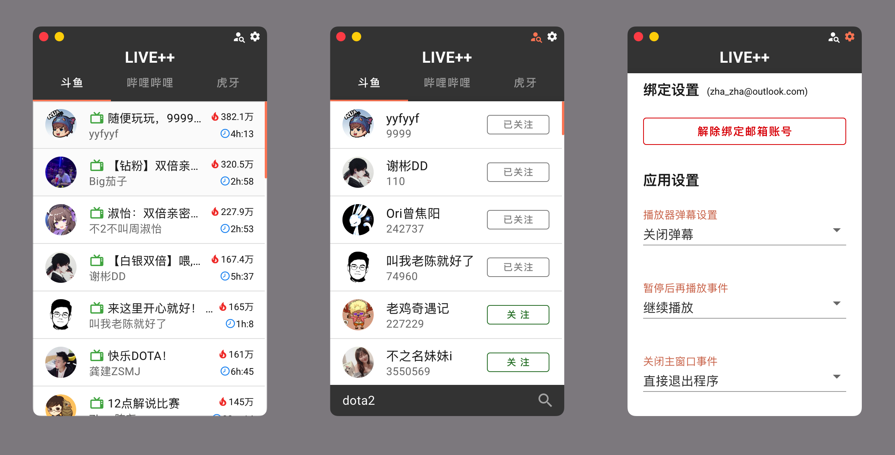
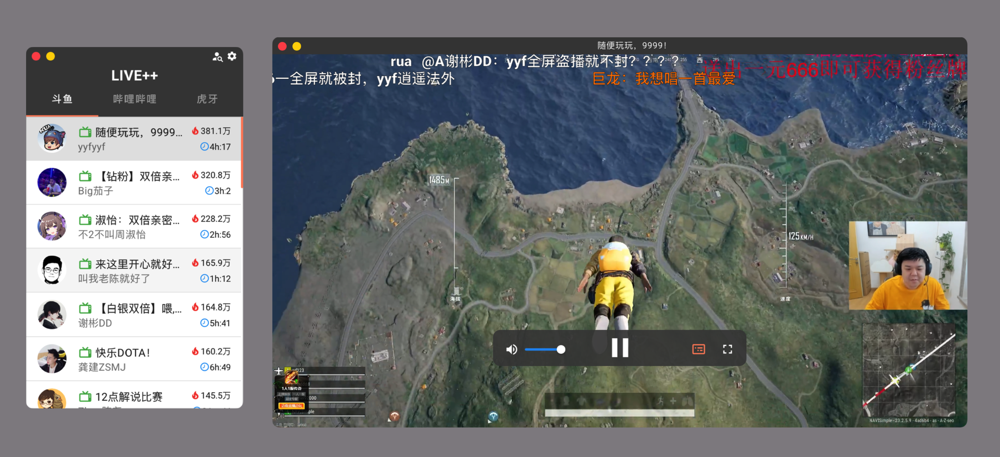

<p align="center">

</p>

<h2 align="center">Live++</h2>

<p align="center">轻轻松松看直播</p>


---

## 项目背景

受到一些抓取直播流的开源代码的启发，一时兴起，写了一个基于electron的pc直播客户端。

因为这些直播平台的网页版，对我来说多余的内容太多了，而我仅仅只是想看直播和弹幕，对于礼物、任务、竞猜等等其他的东西都不感兴趣，并且每次打开网页都加载很慢。于是乎我就写了这个客户端。

可以直接抓取斗鱼、虎牙、哔哩哔哩的直播流进行观看，也支持弹幕的显示。点击就能看，不需要加载过多的内容，加载速度也比网页版本快

可以在设置中选择使用内置播放器还是仅仅获取直播流地址。

---

## 项目说明

node不是我的专业语言，很多功能都是一边查文档一边看别人的代码写的，总体的代码很难看，大佬们见谅。

时隔3年没有更新了，上个月收到了一个Issues之后才感觉到原来还有人在关注，于是抽时间重写一遍，顺便修改了一些以前不足的地方，依旧使用了很多第三方的包，可以在package.json中查看

### **2.0**版本改动：

1. 播放器不再使用DPlayer，而是更换成了VideoJs
2. 弹幕功能使用了vue3-danmaku
3. 关于各个平台的主播信息、直播源信息不再通过node进行解析了，而是专门开发了一个app的服务器，所有的信息（除了弹幕）都会从服务器中获取
4. 关于弹幕的处理，基本没区别，只是虎牙的弹幕不再完全依赖扩展，而是根据[https://github.com/BacooTang/huya-danmu](https://gitee.com/link?target=https%3A%2F%2Fgithub.com%2FBacooTang%2Fhuya-danmu)中的lib文件自行编写了
5. 数据存储使用的 [https://github.com/typicode/lowdb](https://github.com/typicode/lowdb)，另外如果绑定了邮箱则会同步数据到服务器的数据库中
6. 删除了一部分没太大用的设置功能
7. 新增了主播的搜索功能，会根据关键字查询最多50个主播信息，方便用户订阅
8. 直播源地址和取消关注的右键菜单直接集成到了主播列表中，在主播列表点击右键即可看到按钮

---

## 开发和运行环境

```shell
$ node -v
v16.20.0
$ npm -v
8.19.4
```

目前仅调试了windows、macOS系统下的程序运行问题。Linux平台请自行测试。

---

## 程序截图





---

## 联系我

使用中的问题、对产品功能的畅想等等都可以通过Issues、telegram、发送邮件的方式联系我，欢迎更多的朋友能够参与进来

telegram群组分享链接：https://t.me/+BjFbK97ZVxMxZmM1

---

## 捐赠

Live++的使用是完全免费的，不管是否捐助，所使用的功能都是一样的

在2.0.0版本更新中大量的使用了云服务器和代理运营商，所以作者在爱发电平台申请了账号，希望喜欢这款应用的朋友能够支持一下。

爱发电作者主页：https://afdian.net/a/live_plus_plus
