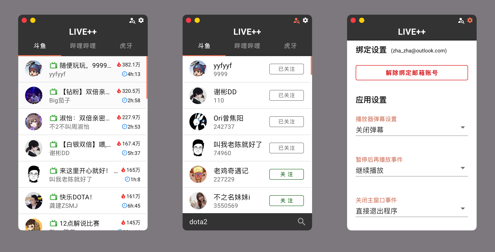
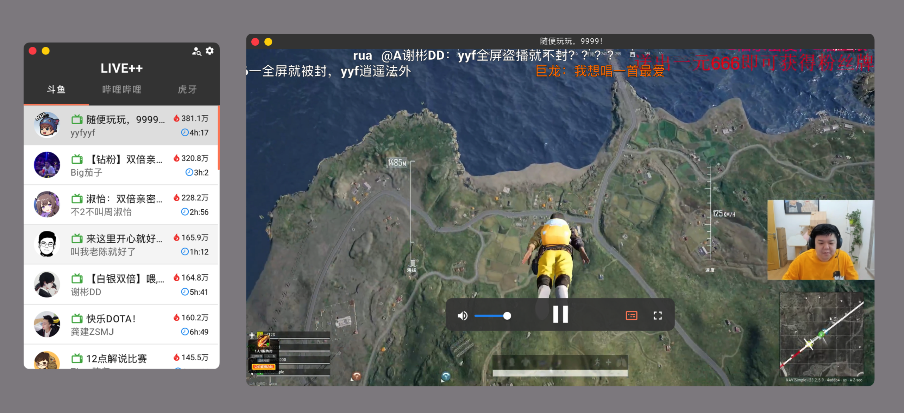

<p align="center">

</p>

<h2 align="center">Live++</h2>

<p align="center">轻轻松松看直播</p>

---

## 项目简介

Live++ 是一款基于 Electron 的跨平台桌面直播客户端，支持 **斗鱼**、**虎牙**、**哔哩哔哩** 三大直播平台。专注于纯粹的直播观看体验——直接抓取直播流播放，去除网页版多余的礼物、任务、广告等内容，加载更快，操作更简洁。

## 功能特性

- 多平台直播源抓取与播放（斗鱼、虎牙、哔哩哔哩）
- 实时弹幕显示，支持调节字体大小和透明度
- 主播搜索与关注管理
- 直播流清晰度切换
- 双击全屏、静音播放
- 虎牙断流自动刷新
- 直播流地址复制（右键菜单）
- 绑定邮箱同步关注数据与配置
- 应用内自动更新检查与提示
- 根据直播视频比例动态调整播放窗口


## 下载安装

前往 [Releases](https://github.com/user/live-plus-plus/releases) 页面下载对应平台的安装包：

| 平台 | 格式 |
|---|---|
| Windows | `.exe` 安装包 / `.zip` 便携版 |
| macOS | `.dmg` / `.zip` |
| Linux | `.AppImage` / `.zip` |

## 开发指南

### 环境要求

```shell
node >= 16.x
npm >= 8.x
```

### 本地运行

```shell
# 安装依赖
npm install

# 启动开发服务
npm run dev
```

### 构建打包

```shell
# Windows
npm run build:win

# macOS（需在 macOS 系统下执行）
npm run build:mac

# Linux
npm run build:linux
```

> Linux 构建建议在 Linux 环境或 Docker 中执行，Windows 上构建 AppImage 需要管理员权限或启用开发者模式。

## 程序截图





## 版本历史

### v2.3.11
- 新增了音量按钮的一键静音功能，增加了音量按钮的图标样式
- 新增了弹幕字体的修改功能，提供了等比缩小到50%或者放大到150%的滑动配置
- 新增了透明度的修改功能，提供了0~1的透明度滑动配置
- 新增了播放窗口双击后自动全屏的功能
- 修改了虎牙直播在断流时的逻辑，由原来的固定25秒刷新改为监听串流加载时长，当加载进度小于某个阈值时则进行自动刷新
- 升级了工程中的依赖包的版本

### v2.3.10
- 修复了部分情况下主播列表点击无法播放的问题
- 更新了直播流切换的逻辑
- 虎牙直播目前每25秒会自动切换到新的地址流上，避免了播放断流的问题，但是会有播放器刷新的卡顿感


### v2.3.9
由于阿里云的免费SSL证书不够用了，于是live++的服务与其他的服务进行了融合，导致API接口地址、自动更新链接地址发生了变化

由于更换服务api地址，此次更新不会在v2.3.8上进行新版本提醒，请手动下载后覆盖安装

### v2.3.8
- 修复第一次开打应用时关注列表不刷新的问题
- 修复windows下窗口阻挡的问题
- 修复公共alert在mac、windows下样式不同的问题

### v2.3.6
- 播放器会根据直播流调整窗口比例

### v2.3.0
- 播放器新增了清晰度切换模块，显示在播放器的右上角
- 修复了弹幕颜色不正确的问题
- 修复了弹幕出现顺序不正确的问题
- 修复了查询主播时的bug

### v2.2.0
- 修复了播放窗口在windows平台下的一些外观问题
- 修复了虎牙直播无法切换的问题
- 修复了部分场景弹幕ws流切换时前一个ws没有断开的问题
- 提高了B站直播流的清晰度
- 修复了主播列表刷新超时的问题
- 添加了系统日志，用来排查问题

### v2.1.0
- 完善了应用设置中的功能
- 主播搜索的时候添加了回车键的支持
- 从2.1.0开始支持自动下载更新了，新版本发布之后打开app会自动检测并且询问更新
- 主播列表页面使用了新的api，不再使用轮训的方式获取主播的实时信息，而是直接批量获取，加快了页面的加载速度
- 更新了代码中的打包配置、License等文件

### v2.0.0（重写版本）
本次的更新变动较大，可能存在一些瑕疵，如有问题可提Issues

关于旧版本，比如1.*.*版本的客户端不再进行更新了

新版本不再支持32位的windows编译文件了，如果需要请自行进行编译

本次测试仅通过了mac、windows平台，Linux请自行编译测试

更新列表：
- 视频播放器更新为了VideoJS视频插件
- 弹幕播放器更新为了vue-danmaku弹幕插件
- 更新了弹幕websocket方式的连接和弹幕数据的获取
- 主播搜索、主播房间详情、直播源地址获取都通过http的api形式进行获取
- 新增了主播的搜索功能，会根据关键字查询最多50个主播信息，方便用户订阅
- 直播源地址和取消关注的右键菜单直接集成到了主播列表中，在主播列表点击右键即可看到按钮
- 新增了邮箱绑定的功能
- 升级了前端的一些依赖，比如vue、vuetifyjs等等

已知存在的问题：
- 配置中的弹幕设置和播放设置功能还未完成
- indows下拖动播放器窗口的过程中可能会有细微的抖动（electron存在已久的bug）
- 由于使用了统一的api进行数据抓取，所以服务器可能会被平台屏蔽，这里采用了代理服务商解决这个问题，但是依旧存在小概率的超时问题
- 虎牙平台下主播如果是录播状态则无法进行播放

## 联系我

使用中的问题、功能建议等都可以通过 Issues、Telegram 或邮件联系我

- Telegram 群组：https://t.me/+BjFbK97ZVxMxZmM1
- 邮箱：zha_zha@outlook.com

## 捐赠

Live++ 完全免费使用，功能不受是否捐赠影响。2.0 版本大量使用了云服务器，如果喜欢这款应用，欢迎支持：

爱发电：https://afdian.com/a/live_plus_plus

## 许可证

[MIT License](LICENSE)
